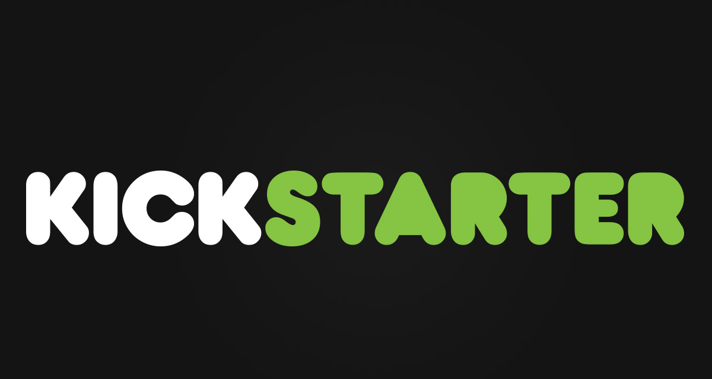

# Kickstarter Predictor Project

## _Will your idea succeed?_

In today's world, there are many ways to fund pet projects, but *Kickstarter* makes it simple. Just like Kickstarter, our app only needs a few bits of information and your off to discover if your idea is worth funding. 

## Information
### Model
Our project will provide a prediction of Success or Fail depending upon the data in our feature columns. Based upon our model, we are 76% certain that it is predicting accurately. We also used a gradient boost to leverage our data to give us the best results. 

### Dataset
We used the "ks-projects-201801" dataset from Kaggle, link below. At first we used a different dataset because this one didn't load for me, because of ghosts as when I loaded it again later in the week, it worked. Hyperparameter tuning using a gridsearch took about an hour.   

### Features

- Landing Page
    - This houses our main page that links to our Prediction and Learn More pages
- Prediction Page
    - This brings you to the prediction page where you find if your project's prediction is Succeed or Fail. We have a link to Learn More, but it only houses dummy data right now. 
- Learn More Page
    - This houses dummy data for right now, we want to add in some analysis points, but we may run out of time. 

## Tech Tools and Libraries

We used a number of tools and libraries to create our application: 

- [Python] - Programming Language
- [Scikit-Learn] - Machine Learning library
- [Pickle] - Serialization tool
- [Flask] - Lightweight web application platform using Python
- [Flask-SQLAlchemy] - PostgreSQL framework for Flask
- [Pandas] - Data analysis module for the Python programming language
- [Numpy] - NumPy is a library adding support for large, multi-dimensional arrays and matrices, along with a large collection of high-level mathematical functions to operate on these arrays.

## How to Access

1. Simply visit this [website](https://buildweektest.herokuapp.com/) and input your values. 
_Note: Since we are using the free version of Heroku, it may take a few minutes to load._

## Links

Application Link: https://buildweektest.herokuapp.com/ 
Dataset Link: https://www.kaggle.com/kemical/kickstarter-projects?select=ks-projects-201801.csv

## Contact

Have a question? Let us know

Arthur Yang:     [LinkedIn](https://www.linkedin.com/in/arthur-yang-4a954b1b/)  |  [GitHub](https://github.com/sysgear) 
Hunter Jordan:   [LinkedIn](https://www.linkedin.com/in/hunterjordanprofile/)  |  [GitHub](https://github.com/HunterJordan) 
Royce Roberts:   [LinkedIn](https://www.linkedin.com/in/royceroberts/)  |  [GitHub](https://github.com/jinjahninjah)

